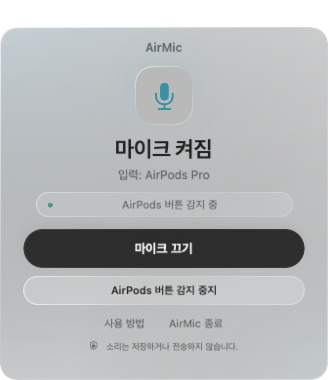
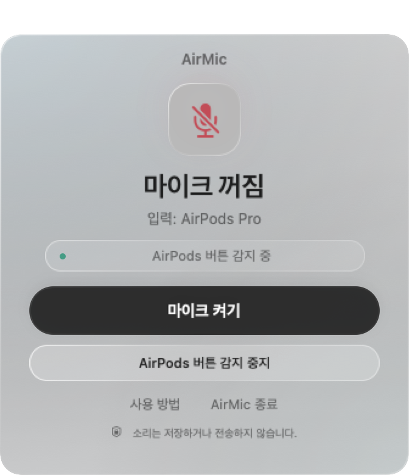

<div align="center">


# AirMic — 에어팟으로 Mac 마이크 음소거

**가볍게 누르고, 조용하게 집중하세요.**

[**Mac용 다운로드 ↗**](https://github.com/minhoyooDEV/AirMic/releases/tag/v0.1.0-beta.1) · [**AirMic 둘러보기**](https://minhoyoodev.github.io/AirMic/ko/)

</div>

[](https://github.com/minhoyooDEV/AirMic/actions/workflows/build.yml)
[](LICENSE)

**AirPods 버튼으로, Mac의 마이크를 간단하게.**

AirPods 줄기 버튼으로 **Mac의 기본 입력 마이크**를 켜고 끄는 작은 메뉴 막대 앱입니다.

[공식 소개](https://minhoyoodev.github.io/AirMic/ko/) · [English](README.md) · [简体中文](https://minhoyoodev.github.io/AirMic/zh-Hans/) · [日本語](https://minhoyoodev.github.io/AirMic/ja/) · [Español](https://minhoyoodev.github.io/AirMic/es/)

Swift·SwiftUI와 Apple 기본 프레임워크로 만들었습니다. 외부 라이브러리나 별도 오디오 드라이버 없이 동작합니다. **한국어·중국어 간체·일본어·스페인어·영어 UI**를 지원하며 macOS 언어 설정을 따릅니다.

> **실험 단계 베타.** 다운로드는 로컬 임시 서명이며 Apple 공증 전입니다. 기존 프로토타입의 AirPods 버튼 동작은 확인했지만, Swift 전환본은 실제 버튼 검증이 남아 있습니다. 자동 검증 성공이 모든 기기·통화 앱의 호환성을 뜻하지는 않습니다.

## 작은 창으로, 상태를 한눈에

| 마이크 켜짐 | 마이크 꺼짐 |
| :---: | :---: |
|  |  |

실제 SwiftUI 화면을 예시 상태로 렌더링했습니다. 마이크에 접근하지 않은 UI 미리보기이며 실기기 호환성 검증을 뜻하지 않습니다. 배경 흐림은 바탕화면과 손쉬운 사용 설정에 따라 달라집니다.

## 다운로드·설치

[**Mac용 AirMic 다운로드 →**](https://github.com/minhoyooDEV/AirMic/releases/tag/v0.1.0-beta.1)

macOS 14 이상의 **Apple Silicon·Intel Mac 공용 DMG**입니다. 개발 도구나 직접 빌드할 필요가 없습니다.

1. 릴리스에서 `AirMic-0.1.0-universal.dmg`를 받습니다.
2. 기존 AirMic은 정상 종료하고, DMG를 열어 AirMic을 **Applications**로 드래그합니다.
3. 앱을 실행합니다. 이 베타는 Developer ID 서명·공증 전이므로, 처음 차단되면 **시스템 설정 → 개인정보 보호 및 보안 → 확인 없이 열기**에서 별도 승인이 필요할 수 있습니다. 신뢰하는 앱에 대해서만 [Apple 공식 안내](https://support.apple.com/102445)를 따르세요.
4. 마이크 접근을 허용하고 AirPods를 연결합니다. 언어는 macOS 설정을 따릅니다.

릴리스에 SHA-256 체크섬과 서명 상태, 검증 범위를 함께 제공합니다.

## 소스에서 빌드

macOS 14 이상, Command Line Tools 또는 Xcode, 호환되는 AirPods와 음소거 제어를 지원하는 마이크가 필요합니다.

```sh
# 개발 도구가 없다면:
xcode-select --install

git clone https://github.com/minhoyooDEV/AirMic.git
cd AirMic
bash build.sh
open build/AirMic.app
```

현재 Mac의 아키텍처에 맞춰 빌드하고 로컬 임시 서명합니다. 공증된 배포 파일은 제공하지 않습니다. Apple Silicon Mac과 AirPods Pro 한 조합에서 실제 버튼 동작을 확인했습니다.

Mac 설치 파일이 필요하면 `bash scripts/package.sh`를 실행하세요. `build/packages/`에 DMG가 생성됩니다. DMG를 열고 AirMic을 Applications로 드래그하면 됩니다. 한·영 안내문이 포함되며, 로컬 임시 서명으로 만든 파일입니다. 이 과정은 GitHub 릴리스를 게시하거나 Apple 공증을 받지 않습니다.

## 사용법

1. AirPods를 연결하고 제어할 마이크를 Mac의 기본 입력으로 선택합니다.
2. 앱을 실행하고 마이크 접근 요청이 나오면 허용합니다. 이미 허용되어 있으면 생략됩니다.
3. ‘AirPods 버튼 감지 중’이 표시되면 줄기 버튼을 누릅니다.
4. 창과 메뉴 막대에서 마이크 켜짐·꺼짐을 확인합니다. 화면 버튼으로도 전환할 수 있습니다.
5. 종료할 때는 메뉴의 ‘종료 (원래 마이크 상태 복원)’를 선택합니다.

창만 닫으면 메뉴 막대에서 계속 동작합니다. 로그인 자동 실행 기능은 없습니다.

약 336 × 390포인트의 작은 SwiftUI 창은 은은한 하늘색의 서리 유리 바탕으로, 밝은 모드·어두운 모드에 맞춰 표시됩니다. 흐릿하게 비치는 데스크톱 배경과 얇은 빛 테두리로 유리의 깊이를 표현하고, 주 버튼은 선명하게 유지합니다. 마이크 상태·입력 장치·AirPods 감지 상태와 큰 음소거 버튼을 볼 수 있습니다. 도움말과 종료도 바로 선택할 수 있습니다. 창이 열려 있으면 Dock과 앱 전환기에 표시되고, 닫으면 메뉴 막대에만 남습니다. 앱을 다시 열면 창이 나타납니다. Command-Q로 종료할 때도 원래 마이크 상태 복원을 시도합니다.

### 언어 설정

macOS의 선호 언어 중 지원되는 언어를 선택하고, 없으면 영어로 표시합니다. AirMic만 다른 언어로 사용하려면 **시스템 설정 → 일반 → 언어 및 지역 → 응용 프로그램**에서 AirMic을 추가하고 한국어·중국어 간체·일본어·스페인어·영어 중 선택하세요. 변경 후 앱을 정상 종료하고 다시 실행하면 적용됩니다.

메뉴·상태·오류·도움말·마이크 권한 안내가 번역되어 있습니다. 진단용 명령줄 출력은 영어로 유지합니다. 다른 언어를 추가하는 방법은 [번역 기여 안내](docs/LOCALIZATION.md)를 참고하세요.

## 알아둘 점

- **현재 기본 입력 장치**를 음소거합니다. 그 마이크를 쓰는 다른 앱에도 적용되지만, 다른 입력 장치를 선택한 앱에는 적용되지 않습니다. 통화 앱 자체의 음소거 아이콘도 바뀌지 않을 수 있습니다.
- 버튼 감지를 위해 입력 전용 Core Audio I/O를 활성화합니다. 마이크 사용 표시가 켜질 수 있고 Bluetooth 음질·배터리에 영향을 줄 수 있습니다.
- 입력 콜백은 오디오 버퍼를 읽지 않습니다. 소리를 저장·전송하거나 재생하지 않습니다.
- 다른 통화 앱이 AirPods 제어를 처리하면 충돌할 수 있습니다. 사용할 앱에서 실제 음소거 여부를 확인하세요.
- 음소거 속성 변경 후 값을 다시 읽어 확인합니다. 상대방에게 소리가 전달되지 않는지까지 보장하는 검사는 아닙니다.
- 기본 입력 장치가 바뀌면 새 장치의 기존 상태를 사용합니다. 이전 음소거 상태가 자동으로 이어지지는 않습니다.
- 강제 종료·장치 연결 해제 시 복원이 안 될 수 있습니다. 다시 연결해 앱을 실행하고 정상 종료하면 복원을 재시도합니다. 이를 위해 원래 장치 ID와 음소거 값만 로컬 설정에 보관합니다.

## 개발 확인

```sh
# 빌드·서명·번들·명령줄 확인 (마이크를 활성화하지 않음)
bash scripts/check.sh

# 읽기 전용 상태 확인
build/AirMic.app/Contents/MacOS/AirMic --check

# 실제 마이크를 잠깐 전환한 뒤 원래 상태로 복원
# 통화나 녹음 중에는 실행하지 마세요.
build/AirMic.app/Contents/MacOS/AirMic --self-test
```

## 제거

앱 메뉴에서 정상 종료하고 마이크 복원을 확인한 다음 앱을 삭제합니다. 설정도 지우려면:

```sh
defaults delete local.airmic.app
```

## 라이선스

[MIT](LICENSE). Apple과 관계없는 독립 프로젝트입니다.

## 참여·유지보수

- [문제 해결](docs/TROUBLESHOOTING.md): 권한, 버튼 감지, 음소거 복원
- [기여 안내](CONTRIBUTING.md): 이슈와 PR 작성, 로컬 검증
- [테스트 범위](docs/TESTING.md) · [구조](docs/ARCHITECTURE.md)
- [유지보수·배포 기준](docs/MAINTAINING.md) · [보안 제보](SECURITY.md)
- [로드맵](docs/ROADMAP.md) · [변경 기록](CHANGELOG.md)

[이슈 양식](https://github.com/minhoyooDEV/AirMic/issues/new/choose)에서 버그·기능·호환성 결과를 남길 수 있습니다. 한국어와 영어 모두 환영합니다. 개인 프로젝트이므로 응답 기한이나 기능 제공 시점을 약속하지는 않습니다.

유지보수 책임과 참여 방법은 [프로젝트 운영 안내](docs/GOVERNANCE.md)를 참고하세요.
