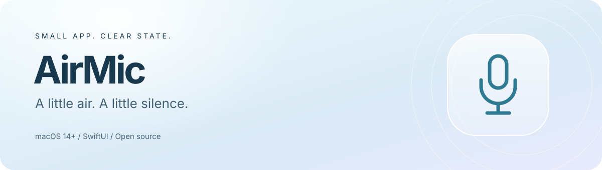
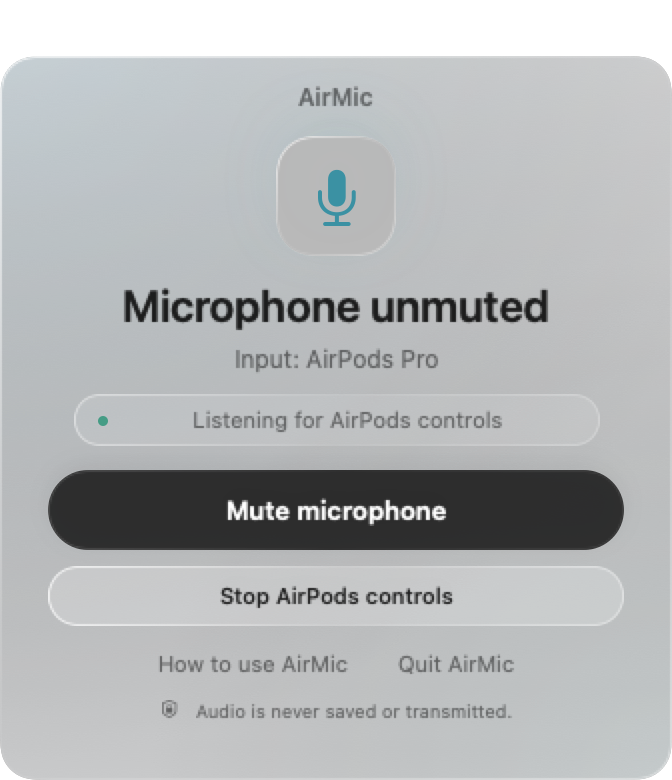
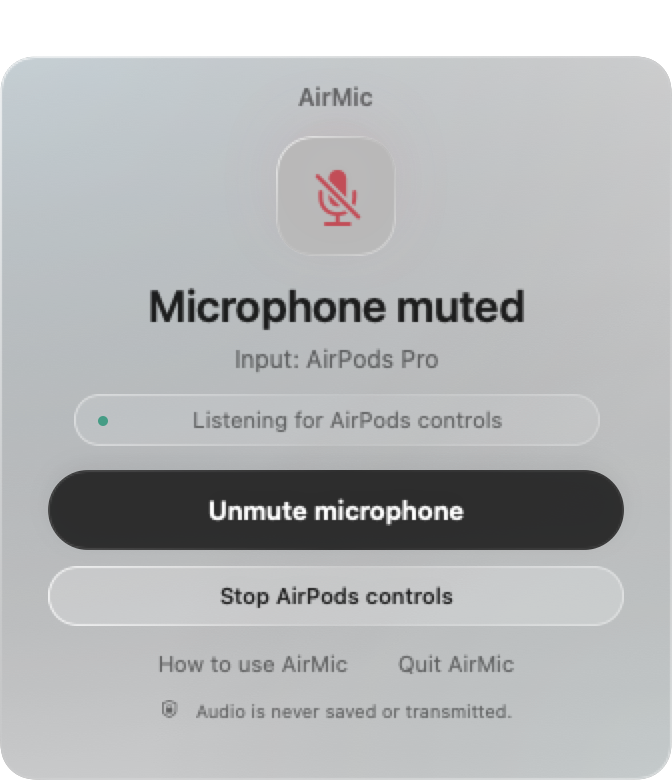

<div align="center">



# AirMic — AirPods microphone mute for Mac

**A little air. A little silence. A simpler Mac.**

[**Download for Mac ↗**](https://github.com/minhoyooDEV/AirMic/releases/tag/v0.1.0-beta.1) · [**Explore AirMic**](https://minhoyoodev.github.io/AirMic/)

</div>

[](https://github.com/minhoyooDEV/AirMic/actions/workflows/build.yml)
[](LICENSE)


**Your AirPods stem. Your Mac's microphone.**

A small native menu bar app that lets you mute and unmute your **default input microphone** with your AirPods stem button.

[Website](https://minhoyoodev.github.io/AirMic/) · [한국어](README.ko.md) · [简体中文](https://minhoyoodev.github.io/AirMic/zh-Hans/) · [日本語](https://minhoyoodev.github.io/AirMic/ja/) · [Español](https://minhoyoodev.github.io/AirMic/es/)

Built with Swift, SwiftUI, and Apple's system frameworks. No dependencies, audio drivers, background services, accounts, or network requests. The interface supports **Korean, Simplified Chinese, Japanese, Spanish, and English**, following your macOS language preferences.

> **Experimental beta.** The download is ad-hoc signed and has not been notarized by Apple. Physical stem control was confirmed with the original prototype; the Swift port still needs physical verification. Automated checks do not prove hardware or conferencing-app compatibility.

| What you need | What AirMic does |
| --- | --- |
| A quick mute gesture | Handles compatible AirPods mute events through Apple's public API |
| A visible state | Shows microphone state in the menu bar and a small status window |
| A clean exit | Attempts to restore the original mute state on normal quit |
| A small, inspectable tool | Uses native frameworks; keeps audio buffers unread |

## A small window. A clear state.

| Microphone on | Microphone muted |
| :---: | :---: |
|  |  |

Actual SwiftUI views rendered with sample state, without microphone access. These previews demonstrate the interface, not verified hardware compatibility. Background blur varies with the desktop and accessibility settings.

## Download and use

[**Download AirMic for Mac →**](https://github.com/minhoyooDEV/AirMic/releases/tag/v0.1.0-beta.1)

One **universal DMG** runs on Apple Silicon and Intel Macs with macOS 14 or later. No Xcode or terminal build is needed.

1. Download `AirMic-0.1.0-universal.dmg` from the release assets.
2. Quit an existing AirMic copy normally, open the DMG, and drag AirMic to **Applications**.
3. Open AirMic. This beta has no Developer ID signature or notarization; macOS may require approval in **System Settings → Privacy & Security → Open Anyway** after the first attempt. Follow [Apple’s official guidance](https://support.apple.com/102445) for apps you trust.
4. Allow microphone access and connect your AirPods. The app language follows macOS.

Each release includes a SHA-256 checksum. Signing status and untested hardware cases are recorded in the release notes.

## Build from source

Requires **macOS 14+**, Apple Command Line Tools or Xcode, compatible AirPods, and a microphone with a writable Core Audio mute control. The original prototype’s stem gesture was tested on one Apple Silicon Mac with AirPods Pro; the current Swift beta and other hardware combinations still need physical verification.

```sh
# Install Apple's developer tools if needed:
xcode-select --install

git clone https://github.com/minhoyooDEV/AirMic.git
cd AirMic
bash build.sh
open build/AirMic.app
```

The script builds for your Mac's architecture and applies a local ad-hoc signature. There is no notarized download. It prefers standalone Command Line Tools when installed; set `DEVELOPER_DIR` to use a particular Xcode installation. Building does not accept Apple's license agreements for you.

To create a local Mac installer, run `bash scripts/package.sh`. The DMG appears in `build/packages/` and contains AirMic, an Applications shortcut, and English/Korean instructions. Open it and drag the app to Applications. This produces the same universal installer format used for beta distribution. It does not publish or notarize the result.

## Use

1. Connect your AirPods and select the microphone you want to control as the Mac's default input.
2. Open AirMic and allow microphone access if prompted.
3. Wait for **Listening for AirPods controls**.
4. Press the stem using your configured mute/unmute gesture. The window and menu bar icon show the microphone's mute state.

You can also toggle mute in the window or menu. Closing the window leaves the app in the menu bar. To stop it, choose **Quit and restore microphone**, which attempts to restore the original mute state of microphones changed by AirMic.

The compact, approximately 336 × 390-point SwiftUI window uses a translucent, frosted pale-blue surface with light/dark appearance, a clear microphone state, and a prominent mute button. Native desktop blur, a light tint, and fine highlighted edges create depth; high-contrast controls keep the main action readable. Help and quit are available directly in the window. While the window is open, AirMic is available in the Dock and app switcher. Closing it returns to menu-bar-only operation; opening the app again shows the window. Command-Q uses the same restoration-aware quit path.

### Language

AirMic chooses the first supported language in your macOS preferences, with English as the fallback. Chinese currently uses Simplified Chinese (`zh-Hans`). To set a language just for AirMic, use **System Settings → General → Language & Region → Applications**, add AirMic, and choose any supported language. Quit normally and reopen the app after changing it. Menus, status/error/help text, and the microphone permission purpose are localized. Diagnostic CLI commands keep stable English output.

Want to add a language? See [localization guidance](docs/LOCALIZATION.md).

## Scope and tradeoffs

- This changes the **device-level mute state of the current default input**, affecting apps that use that microphone. It does not mute every connected microphone or change an app's own mute button.
- Listening uses an input-only Core Audio HAL audio unit and the public `AVAudioApplication` mute handler/notification. The input callback does not read, save, transmit, or play microphone buffers.
- macOS may show its microphone-use indicator. Keeping input I/O active can affect Bluetooth playback quality and battery use.
- Other calling apps may compete for AirPods controls. Do not assume every conferencing app is compatible. Test in your intended app before relying on it.
- AirMic reads back the hardware mute property after changing it. This is not an end-to-end guarantee that another app is silent.
- When the default input changes, AirMic observes the new device's existing mute state; it does **not** carry your previous mute state to that device.
- Force-quitting, crashes, or disconnected devices can prevent restoration. Reconnect the device, launch AirMic, and quit normally to retry. Original device IDs and mute values are stored locally for this purpose.
- No automatic login launch, updater, telemetry, or recording history.

## Development checks

```sh
# Build, verify SwiftUI/localizations and restoration with fake devices; no audio I/O:
bash scripts/check.sh

# Read-only capability/state check:
build/AirMic.app/Contents/MacOS/AirMic --check

# Hardware test: briefly flips mute and restores the original state.
# Avoid running during an active call or recording.
build/AirMic.app/Contents/MacOS/AirMic --self-test
```

`--self-test` exercises real hardware; it is not suitable for unattended CI. The original local prototype passed hardware state restoration and physical AirPods stem checks. See the [test matrix](docs/TESTING.md) for the distinction between local hardware results and public-source CI.

## Help and contributions

| Start here | Details |
| --- | --- |
| [Troubleshooting](docs/TROUBLESHOOTING.md) | Permissions, unsupported inputs, missing gestures, and restoration |
| [Contributing](CONTRIBUTING.md) | Build locally, report a reproducible issue, or propose a focused PR |
| [Architecture](docs/ARCHITECTURE.md) | Audio path, state transitions, and restoration behavior |
| [Testing](docs/TESTING.md) | Automated checks and a manual hardware checklist |
| [Maintenance](docs/MAINTAINING.md) · [Governance](docs/GOVERNANCE.md) | Triage, review, release criteria, and contribution paths |
| [Security](SECURITY.md) | Report a possible vulnerability privately |
| [Roadmap](docs/ROADMAP.md) · [Changes](CHANGELOG.md) | Current priorities and unreleased changes |

Bug reports and compatibility results are welcome in [Issues](https://github.com/minhoyooDEV/AirMic/issues/new/choose). English and Korean are both welcome. This is a spare-time project; response times and future features are not guaranteed.

## Uninstall

Quit from AirMic's menu so it can restore the microphone, then remove the app. To remove saved settings after confirming restoration:

```sh
defaults delete local.airmic.app
```

## Implementation

- `Source/AirMic.swift` — app/menu lifecycle, AirPods events, and CLI
- `Source/GlassUI.swift` — SwiftUI window, state presentation, and native window lifecycle
- `Source/AudioController.swift` — Core Audio adapter and testable mute/restoration state
- `Source/Localization.swift` — native bundle localization helpers
- `Source/Info.plist` — app identity and microphone permission description
- `Resources/*.lproj` — interface and permission translations
- `build.sh` — compile and locally sign the app

A small compatibility header (`Source/AudioApplicationBridge.h`) allows compilation with an older SDK while resolving the **public macOS 14 API** at runtime. The app bundle still requires macOS 14 or later.

References: [Apple mute-handler API](https://developer.apple.com/documentation/avfaudio/avaudioapplication/setinputmutestatechangehandler(_:)), [WWDC23 AirPods audio session](https://developer.apple.com/videos/play/wwdc2023/10233/).

## License

[MIT](LICENSE). AirMic is an independent project, not affiliated with Apple.
